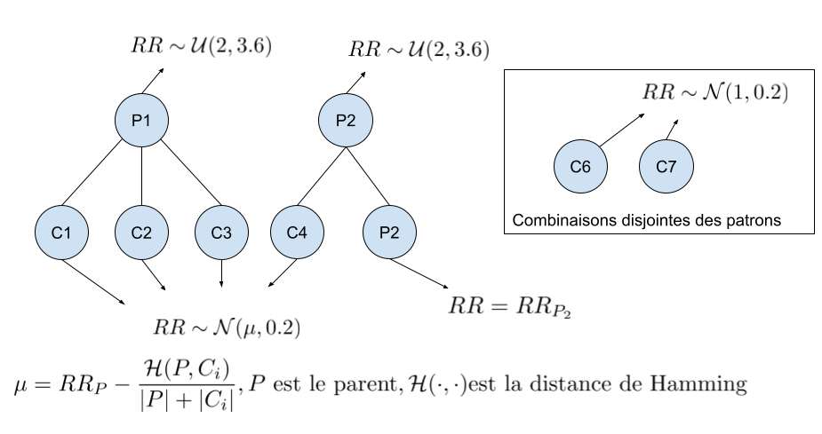

# Simulateur de combinaisons de medicaments

## TL;DR
```python create_dataset.py [--config path/to/config.json --seed your_seed]```

Canevas de `config.json` in `configs/`

## Exemple de donnees produites
| Rx1 | Rx2 | Rx3 | Rx4 | ... | RxN | RR   |
|-----|-----|-----|-----|-----|-----|------|
| 1   | 0   | 0   | 1   | ... | 0   | 3.00 |
| 0   | 1   | 0   | 1   | ... | 1   | 2.67 |
| 0   | 1   | 1   | 1   | ... | 1   | 3.14 |
| ⋮   | ⋮   | ⋮   | ⋮   | ... | ⋮   | ⋮    |
| 1   | 1   | 1   | 1   | ... | 0  | 1.85|


## Abbreviations
* RR = Risque relatif

## Configuration
* `file_identifier`: Base textuelle pour identifier le jeu de données
* `output_dir`: Dossier de sortie pour les fichiers du jeu de données
* `seed`: Graine aléatoire pour le générateur
* `n_combi`: Nombre de combinaisons uniques à produire
* `n_rx`: Nombre de médicaments possibles (nombre de colonnes)
* `mean_rx`: Nombre de médicaments moyen par combinaison (densité)
* `use_gpu`: Booléen, indique si la génération devrait utiliser le GPU s'il est disponible

* `patterns`: Sous-configuration relative aux patrons dangereux
    * `n_patterns`: Nombre de patron dangereux à produire
    * `min_rr`: RR minimal des patrons
    * `max_rr`: RR maximal des patrons
    * `mean_rx`: Nombre moyen de Rx par patron

* `disjoint_combinations`: Sous-configuration relative aux combinaisons disjointes des patrons dangereux
    * `mean_rr`: Moyenne de la normale pour le tirage du RR
    * `std_rr`: Variance de la normale pour le tirage du RR


* `inter_combinations`: Sous-configuration relative aux combinaisons ayant une intersection non vide avec des patrons dangereux
    * `std_rr`: Variance de la normale pour le tirage du RR


## Distributions utilisees
### Patrons
Ici, on utilise des distributions uniformes dans l'intervalle [`patterns:min_rr`, `patterns:max_rr`] afin de faciliter la creation de jeux de donnees plus ou moins difficiles

### Combinaisons avec intersection avec un patron
On utilise une normale d'ecart-type`inter_combinations:std_rr` et avec une moyenne calculée a l'aide de la similarite entre les combinaisons et les patrons dangereux.

### Combinaisons disjointe des patrons
On utilise une normale de moyenne `disjoint_combinations:mean_rr` et d'écart-type `disjoint_combinations:std_rr`. Les combinaisons reliées à un patron seront donc plus proches d'un RR predeterminé par la configuration.


## Idee generale
1. Générer des patrons dangereux et des risques associés de manière aléatoire
2. Générer des combinaisons
3. Générer des risques bases sur la similarité entre les combinaisons et les patrons.

On peut voir ça comme une coupe qui déborde dans d'autres coupes, ou bien un arbre. Chaque patron est une racine de laquelle découlent plusieurs combinaisons. Une combinaison est associée à un patron si le patron est son voisin le plus proche selon la distance de Hamming. Cependant, une combinaison peut être mise dans un autre ensemble à part si aucun medicament n'est partagé entre la combinaison et le patron le plus proche.




## Troubleshooting
1. Si bloque sur "Regenerating bad combinations...", il est possible que le nombre de combinaisons possibles "en moyenne" soit plus petit que le nombre de combinaisons que l'on tente de générer. Autrement dit, on devrait augmenter le nombre de Rx moyen par combinaisons, sinon on est pris dans une boucle infinie.
Pour garantir une boucle finie, il suffit d'avoir que

$$ C_k(n) = {n \choose k} = \frac{n!}{k!(n-k)!} $$

où $n$ est le nombre de Rx, $k$ est le nombre de Rx moyen par combinaison. Cette condition est suffisante, mais pas nécessaire, comme on travaille en espérance.